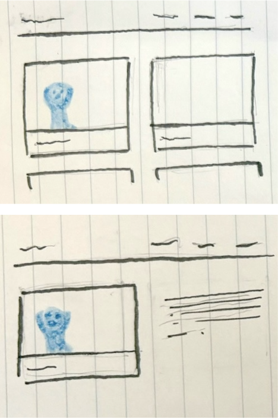
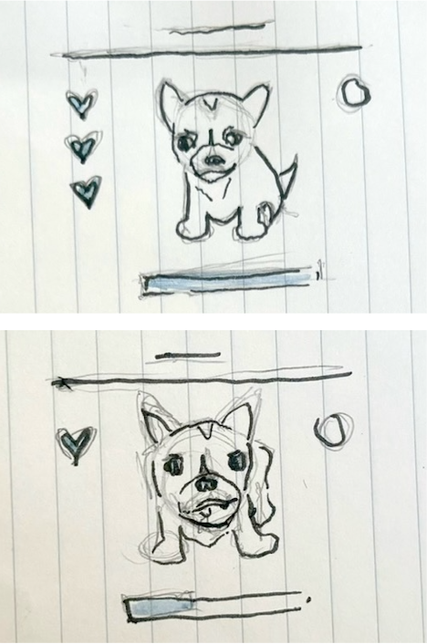
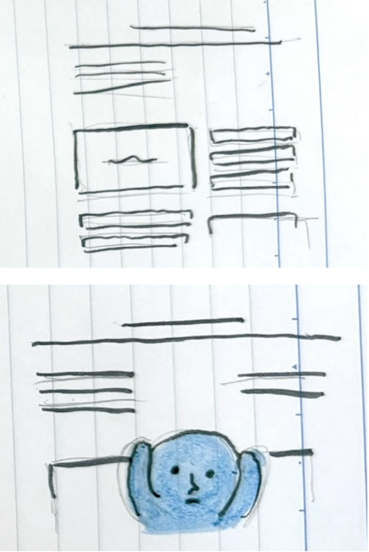

<mark>**Note that this document order from FP4 -> FP1**</mark>

<mark>Please sign up for the study</mark> at [https://tinyurl.com/pui-study](https://tinyurl.com/pui-study) to allow us to use your submission to create a better GenAI assistant for designers!

---

# **FP4 \- Final Project Writeup**

Feel free to refer to this [Markdown Cheat Sheet](https://www.markdownguide.org/cheat-sheet/) to make your writeup more organized, and you can preview your markdown file in VSCode [Markdown editing with Visual Studio Code](https://code.visualstudio.com/docs/languages/markdown#_markdown-preview). 

## Part 1: Website Description

Describe your website (300 words).

* What is the purpose of your website?   
* Who is the target audience?  
* What information do you convey with your website?   
* How is it interesting and engaging? 

## Part 2: User Interaction

How a user would interact with your website? For each step, briefly but clearly state the interaction type & how we should reproduce it.

1. Interaction type. Click on X on page Y / scroll on page X, etc.  
2. 

## Part 3: External Tool

Describe what important external tool you used (JavaScript library, Web API, animations, or other). Following the bulleted list format below, reply to each of the prompts.

1. Name of tool1  
   * Why did you choose to use it over other alternatives? (2 sentences max)  
   * How you used it? (2 sentences max)  
   * What does it add to your website? (2 sentences max)  
2. Name of tool2

## Part 4: Design Iteration

Describe how you iterated on your prototypes, if at all, including any changes you made to your original design while you were implementing your website and the rationale for the changes. (4-8 sentences max)

## Part 5: Implementation Challenge

What challenges did you experience in implementing your website? (2-4 sentences max)

## Part 6: Generative AI Use and Reflection

Describe how you used Generative AI tools to create this final project (fill in the following information, write \~500 words in total).

Document your use of all GenAI tools — ChatGPT, Copilot, Claude, Cursor, etc. using the template below. Add/Delete rows or bullet points if needed, and replace Tool1/Tool2 with the name of the tool.

### Usage Experiences by Project Aspects

Feel free to edit the column \_ (other?) or add more columns if there's any other aspect in your project you've used the GenAI tools for.

For the following aspects of your project, edit the corresponding table cell to answer:
- *Usage*: Whether you used / did not use this tool for the aspect. Enter [Yes/No]
- *Productivity*: Give a rating on whether this tool makes your productivity for X aspect [1-Much Reduced, 2-Reduced, 3-Slightly Reduced, 4-Not Reduced nor Improved, 5-Slightly Improved, 6-Improved, 7-Much Improved].

| Tool Name | Ratings | design | plan | write code | debug | \_ (other?) |
| :---- | :---- | :---- | :---- | :---- | :---- | :---- |
| Tool1 | Usage | Yes/No | Yes/No | Yes/No | Yes/No | Yes/No |
| Tool1 | Productivity | 1~7 | 1~7 | 1~7 | 1~7 | 1~7 |
| Tool2| Usage | Yes/No | Yes/No | Yes/No | Yes/No | Yes/No |
| Tool2 | Productivity | 1~7 | 1~7 | 1~7 | 1~7 | 1~7 |

### Usage Reflection

> Impact on your design and plan 
* It matched my expectations and plan in [FP2](#generative-ai-use-plan) in that … For example, 
  1. Tool1: 
  2. Tool2:
* It did not match my expectations and plan in [FP2](#generative-ai-use-plan) in that … For example, 
  1. Tool1: 
  2. Tool2:
* GenAI tool did/did not influence my final design and implementation plan because … For example, 
  1. Tool1: 
  2. Tool2:

> Use patterns
* I accepted the generations when …  For example, 
  1. Tool1: this tool once suggested … and I adjusted my design according to the suggestion because … 
  2. Tool2: 
* I critiqued/evaluated the generated suggestions by … For example, 
  1. Tool1: this tool once suggested … but I modified/rejected the suggestion because … 
  2. Tool2: 

> Pros and cons of using GenAI tools
* Pros
  1. Tool1: 
  2. Tool2:
* Cons
  1. Tool1: 
  2. Tool2:

### Usage Log

Document the usage logs (prompts and chat history links) for the GenAI tools you used. Some tools may not have an easy way to share usage logs, just try your best! Some instructions for different tools:

1. [ChatGPT](https://help.openai.com/en/articles/7925741-chatgpt-shared-links-faq) / [Gemini](https://support.google.com/gemini/answer/13743730?hl=en&co=GENIE.Platform%3DDesktop): share the anonymous link to all of your chat histories relevant to this project
2. [GitHub Copilot (VSCode)](https://code.visualstudio.com/docs/copilot/copilot-chat#:~:text=You%20can%20export%20all%20prompts%20and%20responses%20for%20a%20chat%20session%20in%20a%20JSON%20file%20with%20the%20Chat%3A%20Export%20Session...%20command%20(workbench.action.chat.export)%20in%20the%20Command%20Palette.): export chat histories relevant to this project.

---

# **FP3 \- Final Project Check-in**

Document the changes and progress of your project. How have you followed or changed your implementation & GenAI use plan and why? Remember to commit your code to save your progress.

## Implementation Plan Updates

- [ ] ...

## Generative AI Use Plan Updates

- [ ] ...

Remember to keep track of your prompts and usage for [FP4 writeup](#part-6-generative-ai-use-and-reflection).

---

# **FP2 \- Evaluation of the Final project**

## Project Description

Briefly restate your motivation and a short description of your project.

## High-Fi Prototypes

### *Prototype 1*

A brief description and summary of the user feedback (\<100 words, 2 images) 

### *Prototype 2*

…

## Usability Test

Discuss the user feedback you got during the evaluation / usability test (\~300 words). Indicate which feedback you implemented, inspired new directions, or otherwise influenced your final design. 

## Updated Designs

Show screenshots of your updated design based on the user feedback (\<100 words, \~2 images).

## Feedback Summary

Summarize the feedback you received in the lab session and discuss how it influenced your design (\~300 words). 

## Milestones

Outline weekly milestones to plan your expected implementation progress until the end of the semester (\~300 words). 

### *Implementation Plan*

- [ ] Week 9 Oct 28 \- Nov 1:
  - [X] FP1 due
  - [ ] ...
  
- [ ] Week 10 Nov 4 \- Nov 8:   
  - [ ] FP2 due

- [ ] Week 11 Nov 11 \- Nov 15:  
- [ ] Week 12 Nov 18 \- Nov 22:   
- [ ] Week 13 Nov 25 \- Nov 29:  

  - [ ] Thanksgiving  
- [ ] Week 14 Dec 2 \- Dec 6:  
  - [ ] FP4 due 

### *Libraries and Other Components*

List the JS libraries and other components (if applicable) that you plan to use. 
* 

## Generative AI Use Plan

Outline how you plan to use Generative AI tools to aid in the implementation (\~300 words).

### *Tool Use*

 What would you use? Edit the list given your plan. For each tool, explain briefly on what do you expect Generative AI to help you with and what might it not be able to help you with.

* ChatGPT  
  * I will use it for … because it can help me …  
  * I will not use it for … because it might not be able to help me with …   
* GitHub Copilot  
* ...

### *Responsible Use*

How would you use Generative AI responsibly? 

---

# **FP1 \- Proposal for Critique**

## *Idea 1*

I want to create a personal portfolio to show off my design projects and creative process and use it for job applications, but also   to have a compilation of my works. I want to make it interactive and fun, with customizable interfaces, such as animations that users can adjust themselves. I want to keep the portfolio accessible by making sure everything’s clear and easy to navigate. Mostly, I want it to show off the different range of projects I’ve done and give a peek into the ideas behind them.

## *Idea 2*

I want to build a virtual pet simulator for a fun experience that users can simply enjoy. I’m plan to make it interactive, where the pet reacts based on what you do with it, showing different moods or actions. I’ll keep it simple and accessible, with visuals that are easy to follow and clear instructions. The main component is just to have a playful experience, taking care of a cute, digital pet you can hang out with.

## *Idea 3*

I want to design a personality test that helps people discover insights about their personality traits. It’ll be interactive by asking questions that feel engaging and require some thought. I want to make sure that everything flows nicely so it’s smooth from start to finish, and then at the end, you’ll get a summary and representation of your personality type, giving people a way to explore who they are in a fun, casual way.

## Feedback Summary

In the lab session, I received some really helpful critiques on how to approach better the design of the websites I had in mind. First, I was advised to think carefully about the visual identity of each of my ideas. The suggestion was to make sure I have a clear vision of the aesthetic for each theme so that I can build interactions that make sense for the overall look and feel of my site. Knowing the aesthetics I want will, in turn, help me build cohesive user experiences as to the intended purpose behind my ideas, ensuring that the interactions I include feel intentional and actually enhance the content.
Another point was to spend some time exploring examples of existing websites to gather inspiration for the ideas I had. I was encouraged to look at different interactive sites to see how they utilized visual elements along with user engagement. By analyzing these references, I can get a better sense of what works and what doesn’t, or what I prefer or not, and draw from them to bring my ideas to life. Furthermore, to have a strong foundation of the interactions I want to include, I was recommended to build a mood board in order to lay out the overall imagery of the ideas I had in mind, to create these interactions that are engaging and aligned with the style I want to present.
A piece of critique that resonated a lot with me was the importance for me to ensure that the interactions I included would help to enhance the information I was attempting to convey rather than distract attention from it. This advice was important to me to hear as it reminded me that design should be purposeful. The interactive elements I include with my website should have a reason, which is to make the content I am conveying clear, engaging, and memorable for the user.  

## Feedback Digestion

In digesting all the feedback I received in the lab, they all felt important for me to consider,  and I’m excited to act on them for my designs. The comment about defining a clear visual identity for each idea is definitely something I’ll work on and should start with. It’s easy for me to get caught up in the interactions themselves, which in turn deters from the original intents of the idea. Having a solid visual direction as a foundation will make sure that everything on the website flows and feels cohesive. I’m going to start this time by mood-boarding the aesthetics and vibes I want to go with for the idea I want to pursue, which should help me see what elements could become interactive and what could enhance the user’s experience.
The suggestion to look at examples of interactive websites for inspiration is also something I should explore. I think seeing how other sites handle interactions and engage users could be very inspiring and spark ideas I hadn’t even considered. Doing so will also help me identify what works in terms of usability and visual appeal so I can learn from this website while also putting my creative spin on things. Exploring different sites and building a mood board will not only refine my vision but also let me learn effective, established techniques that already work.
Lastly, the advice to make sure my interactions actually enhance the information rather than distract from it is something I’ll keep top of mind. I always seem to consider the "wow factor" of interactions, so this critique really reminded me that there should be a balance. I want to give the user a great experience without losing the main point of the initial subject. Overall, these critiques were very insightful and are elements I will incorporate in my next design.

